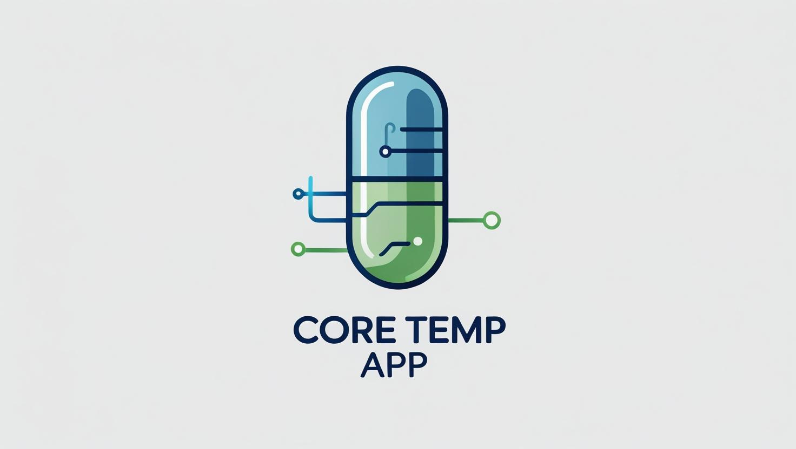

  

## Description

**Core Temp App** is an interactive tool designed for researchers (e.g., physiologists) and healthcare professionals using [Body Cap](https://www.bodycap-medical.com/e-celsius-performance-body-temperature-monitoring-telemetric-pill/) pills to measure core body temperature. This app helps analyze temperature data under different conditions (hot vs neutral) and across different time periods (baseline, exercise, rest).

## Features

- Import CSV files generated by the Body Cap software.
- Select pills to analyze.
- Define periods of interest.
- Visually inspect data to detect anomalies.
- Export filtered data as TSV files with calculated means, standard deviations, and measurement counts per period.

## Live Application

🌐 [Core Temp App - Web Application](https://luc-souilla.shinyapps.io/Body_Temp_App/)

## Citation
If you use Core Temp App in your research, please cite:

    Souilla, L. (2025). Core Temp App: Interactive tool for analyzing core body temperature data from Body Cap pills. Available at: https://github.com/Souilla-Luc/Core_Temp_App

---
